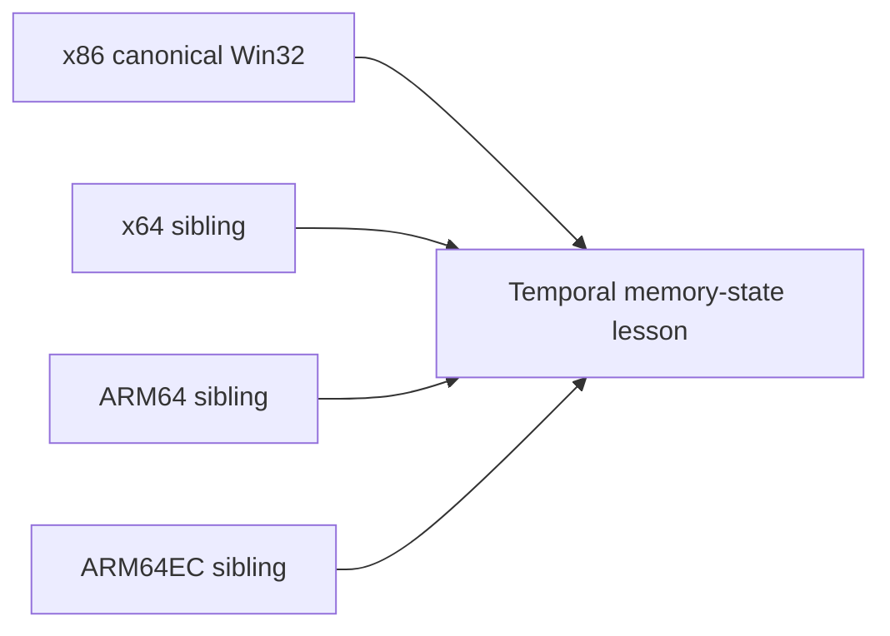

# Architecture Comparison

Gargoyle keeps Win32 canonical and treats other architectures as sibling
demonstrations with explicit caveats.

| Architecture | Role | PIC Source | Re-entry Shape | Best Evidence | Does Not Prove |
| --- | --- | --- | --- | --- | --- |
| x86 | Canonical original | NASM flat binary | ROP gadget and trampoline | Live MessageBox rounds plus optional memory-map observation | Callback identity, every protection transition, or modern x64/ARM mechanics |
| x64 | Sibling demonstration | NASM flat binary | Separate re-entry PIC | Live MessageBox rounds | Callback identity, every protection transition, or transparent x86 stack-pivot port |
| ARM64 | Sibling demonstration | ARMASM COFF `.text` extraction | Re-entry assembly | Hosted headless rounds with completed/callback counters | Desktop live behavior without ARM lab |
| ARM64EC | Sibling demonstration | ARMASM COFF `.text` extraction with ARM64EC options | Re-entry assembly and EC-code allocation path used by this demo | Hosted architecture/headless checks with completed/callback counters | Mixed x64 DLL interop or general ARM64EC dynamic-code behavior |

## Mode Support

| Platform | Artifacts | Architecture Report | Headless | Live MessageBox |
| --- | --- | --- | --- | --- |
| x86 | Yes | Yes | No; not meaningful unless implemented in the native runtime | Yes |
| x64 | Yes | Yes | No; not meaningful unless implemented in the native runtime | Yes |
| ARM64 | Yes | Yes | Yes; checks completed and callback rounds | Yes, on a suitable ARM64 desktop lab |
| ARM64EC | Yes | Yes | Yes; checks completed and callback rounds | Yes, on a suitable ARM64EC-capable desktop lab |

## Shared Claims

All architectures keep the demo benign and visible. All use timer/APC re-entry
and an alertable `SleepEx` wait for the corrected evidence semantics. The
x86/x64 live MessageBox path validates controlled re-entry behavior; the ARM
headless path additionally records callback counters.

## Refresh Summary

The 2026 refresh added build tooling, a typed acceptance harness, native quality
checks, Windows-on-Arm smoke validation, and layered documentation. The refresh
improves reproducibility and claim discipline; it does not expand Gargoyle into
an operational framework.
