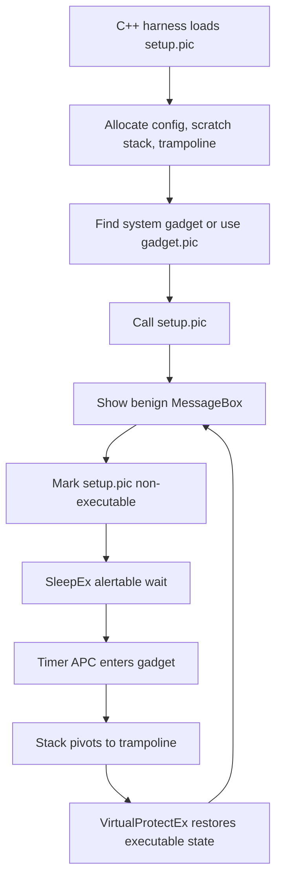

# Win32 Original

The Win32 path is the canonical Gargoyle proof of concept. It builds from the
root solution with `Platform=x86` and keeps the original stack-pivot story
visible.

## Files

- `main.cpp`
- `setup.nasm`
- `gadget.nasm`
- `Gargoyle.vcxproj`

## Lifecycle

## What It Proves

The live harness validates initial PIC handoff and later re-entry into the
benign demo path when it closes two benign `gargoyle` MessageBoxes. The second
round is consistent with the intended timer/APC path after an alertable
`SleepEx` wait, but the live check does not independently prove callback
identity or observe every memory-protection transition.

Manual memory-map observation can suggest the temporal protection cycle by
showing the setup PIC executable while active and non-executable while dormant.

## Caveats

- This is the historical 32-bit design.
- Gadget availability can vary by Windows version and installed modules.
- The fallback gadget path is logged for reproducibility.
- The demo does not prove stealth, endpoint bypass, or every transient memory
  state.

See [Live MessageBox](../validation/live-messagebox.md) and
[Responsible Use](../responsible-use.md).
