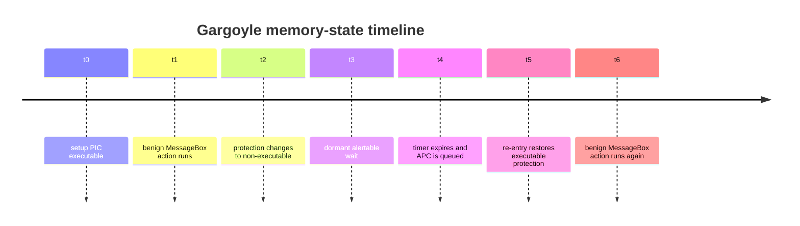

# Temporal Memory State

Gargoyle's durable idea is that memory state changes over time. A region can be
executable while a benign action runs, then non-executable while the process is
dormant. A scanner that only inspects executable private pages at one instant may
miss the dormant region.

## The Cycle

The point is not invisibility. The region still exists in the process. Timers,
APCs, private allocations, stacks, memory-protection transitions, and console
output remain visible to defenders and lab tooling.

## What It Demonstrates

Gargoyle demonstrates that a benign program can place its own code in a
non-executable dormant state and later re-enter it through controlled
timer/APC-oriented mechanics. It does not prove that real endpoint products can
be bypassed.

## What To Read Next

- [Windows Primitives](windows-primitives.md)
- [Timer APC And SleepEx](timer-apc-sleepex.md)
- [Validation Limitations](../validation/limitations.md)
- [Responsible Use](../responsible-use.md)
