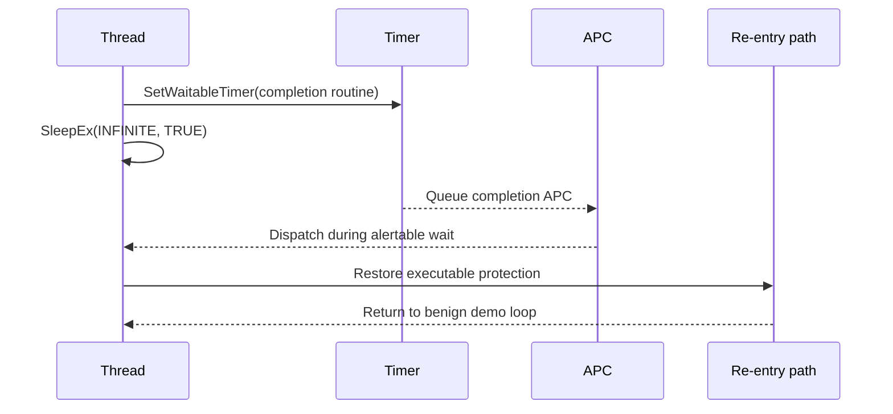

# Timer APC And SleepEx

The most important semantic fix in the refresh is the move to
`SleepEx(INFINITE, TRUE)` for timer/APC re-entry waits.

## Corrected Model

The corrected demo path is designed around APC dispatch during an alertable
sleep. The second live MessageBox validates controlled re-entry after that
alertable wait and is consistent with the intended timer/APC path. The live
x86/x64 check still does not independently prove callback identity or record
every protection transition. ARM64 and ARM64EC headless runs add explicit
completed-round and callback-round counters for stronger non-interactive
callback evidence.

## Weak Mental Model

That shape can make a demo look successful even when the APC did not execute.
The repository documents the weakness because finding and fixing it is part of
the research value.

## Architecture Impact

- x86 preserves the original ROP/trampoline story but uses an alertable sleep for
  re-entry evidence.
- x64 uses a separate re-entry PIC that enters `SleepEx`.
- ARM64 and ARM64EC use re-entry assembly that also calls `SleepEx`.

See [Validation Overview](../validation/overview.md) for what this validates and
[Responsible Use](../responsible-use.md) for scope limits.
