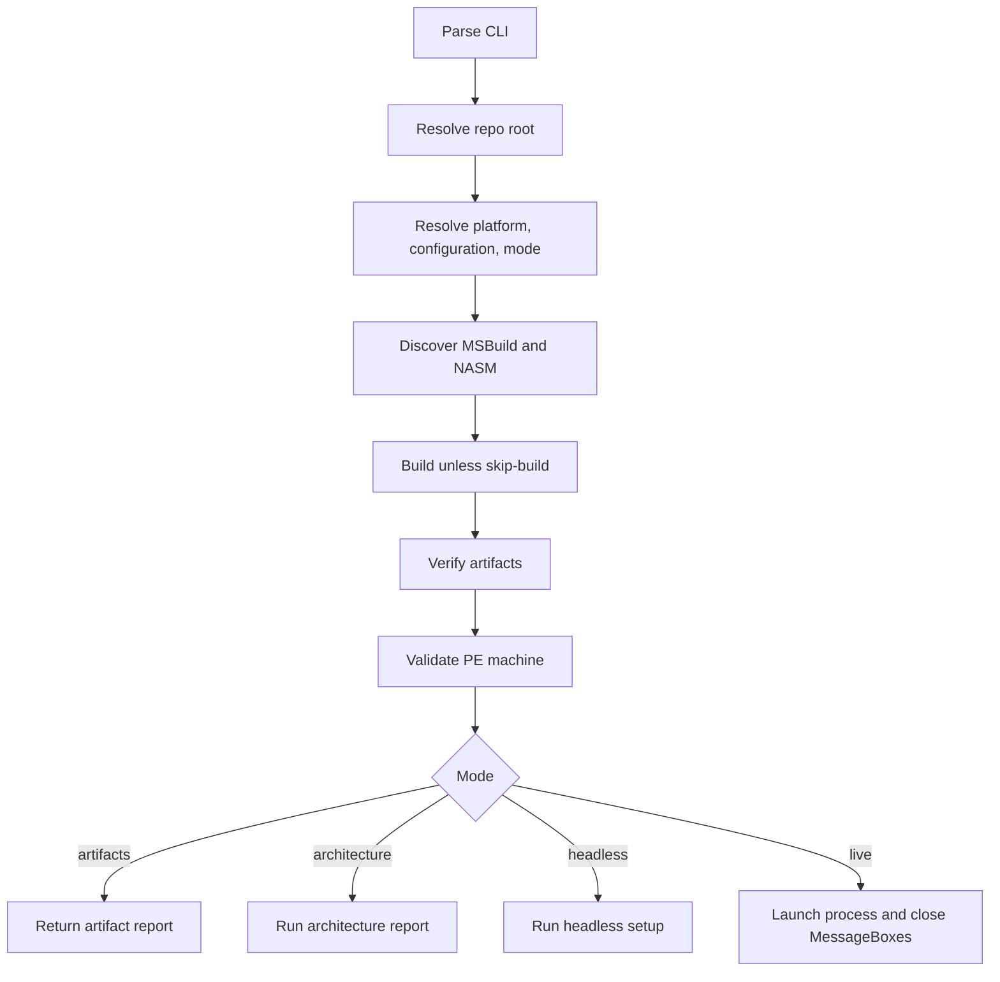

# Acceptance Harness

The Python acceptance harness is the main reproducibility layer. It builds the
requested platform, verifies artifacts, validates PE machine compatibility, and
then runs the selected acceptance mode.

## CLI Model

```powershell
uv run --all-groups gargoyle-acceptance --configuration Debug --platform x86 --mode live
```

Supported configurations are `Debug` and `Release`. Supported platforms are
`x86`, `x64`, `arm64`, and `arm64ec`. Supported modes are `live`,
`artifacts`, `architecture`, and `headless`.

Mode parsing is generic, but runtime support is not a full cross-product.

| Platform | Artifacts | Architecture Report | Headless | Live MessageBox |
| --- | --- | --- | --- | --- |
| x86 | Yes | Yes | No; not meaningful unless implemented in the native runtime | Yes |
| x64 | Yes | Yes | No; not meaningful unless implemented in the native runtime | Yes |
| ARM64 | Yes | Yes | Yes; checks completed and callback rounds | Yes, on a suitable ARM64 desktop lab |
| ARM64EC | Yes | Yes | Yes; checks completed and callback rounds | Yes, on a suitable ARM64EC-capable desktop lab |

## Flow



## Important Modules

| Module | Responsibility |
| --- | --- |
| `environment.py` | Toolchain, platform, configuration, mode, and artifact discovery. |
| `build.py` | MSBuild command construction and build failure reporting. |
| `harness.py` | High-level run orchestration, setup banner parsing, runtime mode dispatch, and MessageBox automation. |
| `architecture.py` | Architecture-report parsing and compatibility checks for machine, platform, pointer width, process architecture, and native machine facts. |
| `pe.py` | PE-machine parsing and platform compatibility validation. |
| `windows.py` | Visible MessageBox window discovery and closing for live desktop validation. |

## Evidence By Mode

| Mode | Code Path | Evidence Collected |
| --- | --- | --- |
| `artifacts` | Build, artifact resolution, PE-machine validation. | Expected executable and PIC files exist; PE machine is compatible with the requested platform. |
| `architecture` | Runs `--architecture-report`. | Runtime-reported platform, machine, pointer width, and process/native architecture facts. |
| `headless` | Runs `--mode headless`. | ARM64/ARM64EC setup banner plus completed-round and callback-round counter checks. |
| `live` | Launches the process and closes visible MessageBoxes. | Setup banner plus requested MessageBox rounds; validates controlled live re-entry behavior but not callback identity. |

For ARM64EC, PE validation accepts the expected image family rather than a
single machine value: `AMD64`, `ARM64`, `ARM64X`, or `ARM64EC`.

Some historical source comments and stdout markers retain legacy "payload"
wording because the harness parses checked-in output. Public documentation
should use "benign demo action" unless quoting or explaining historical text.

The generated [Python API](../api.md) documents public module surfaces.
