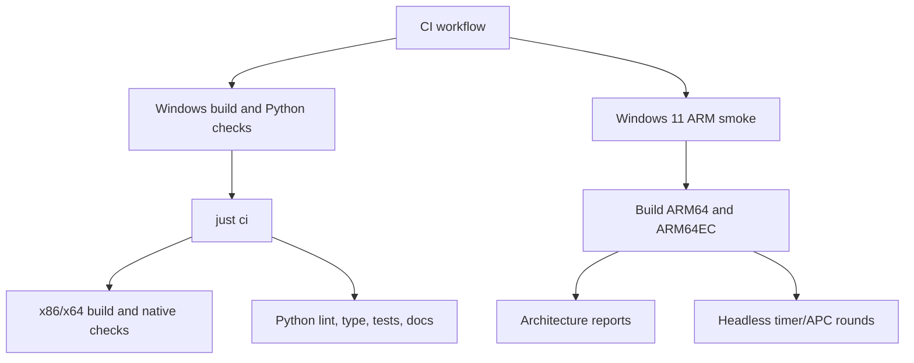

# Tests And CI

The test system checks Python behavior, documentation, native builds, and hosted
Windows-on-Arm smoke evidence.

## Local Checks

```powershell
just check
just ci
```

`just check` runs formatting, linting, pydoclint, mypy, pytest with coverage, and
MkDocs strict build. Coverage must remain at or above the threshold configured in
`pyproject.toml`.

`just ci` adds dependency sync, lock checking, x86/x64 builds, MSVC code
analysis, and AddressSanitizer builds.

| Check | Runs Where | Covers | Does Not Cover |
| --- | --- | --- | --- |
| `just docs` | Local or CI-capable shell | MkDocs strict build and Mermaid fence configuration. | Python tests or native builds. |
| `just check` | Local or Windows x64 CI | Python format, lint, pydoclint, mypy, tests, coverage, and docs. | Native build health. |
| `just ci` | Windows x64 CI | Dependency lock, Python checks, x86/x64 builds, native code analysis, and ASan builds. | ARM live desktop validation or ARM64/ARM64EC runtime smoke. |
| `just windows-arm-smoke` | Hosted `windows-11-arm` runner | ARM64/ARM64EC builds, PE validation, architecture reports, and headless rounds; also probes x86/x64 architecture reports under Windows-on-Arm. | Interactive desktop MessageBox validation. |

## Test Modules

| Test Module | Coverage Focus |
| --- | --- |
| `tests/test_architecture.py` | Architecture-report parsing and platform compatibility. |
| `tests/test_build.py` | MSBuild command construction. |
| `tests/test_cli.py` | Typer CLI option dispatch and report rendering. |
| `tests/test_environment.py` | Platform, configuration, mode parsing, artifact paths, and toolchain discovery. |
| `tests/test_errors.py` | Acceptance error formatting. |
| `tests/test_harness.py` | Runtime mode dispatch, setup parsing, artifact validation, and MessageBox automation helpers. |
| `tests/test_pe.py` | PE-machine parsing and platform compatibility, including ARM64EC image-family values. |

## CI Flow



## CI Limitations

CI-safe checks do not replace live desktop MessageBox validation. The ARM job
runs short benign headless processes and architecture probes; it avoids GUI
automation.

See [Validation Overview](../validation/overview.md) for claim language.
