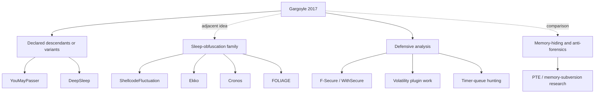

# Lineage

Lineage claims need care. Direct descent requires a source to describe the work
as Gargoyle-derived or Gargoyle-like. Shared problem space alone is not enough.

## Categories

- Direct or declared descendants: projects that explicitly cite Gargoyle as a
  basis or variant. The map uses this category for YouMayPasser and DeepSleep.
- Adjacent sleep-obfuscation work: projects that share timer, sleep, memory
  permission, or dormant-state ideas without necessarily descending from
  Gargoyle. The map uses this category for ShellcodeFluctuation, Ekko, Cronos,
  and FOLIAGE.
- Defensive work: memory hunting, forensics, and timer/APC inspection.
- Stronger memory-hiding research: work that changes enumeration or memory-map
  visibility rather than only current page protections.

Every named node in this map has a corresponding entry in
[References](references.md). Solid edges indicate declared lineage or analysis
directly centered on Gargoyle. Dotted edges indicate adjacent work or comparison
only.
